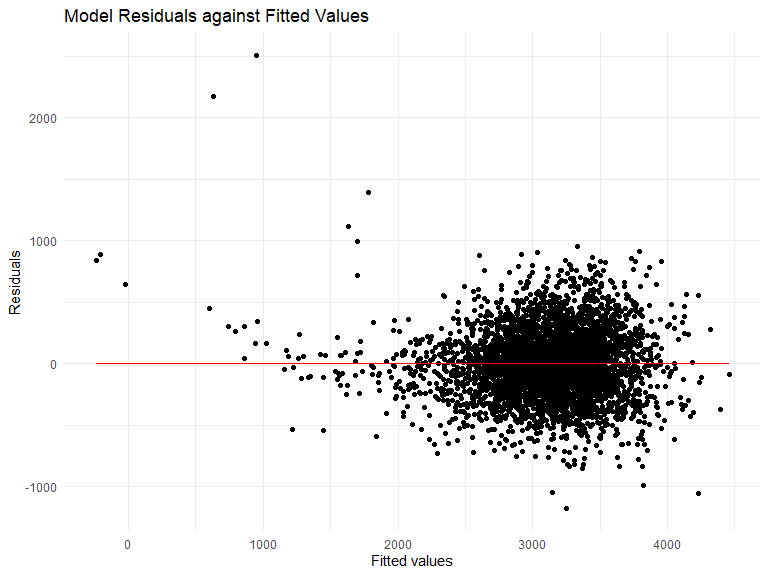
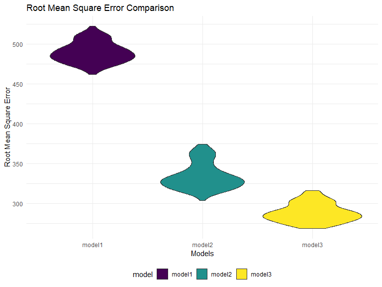
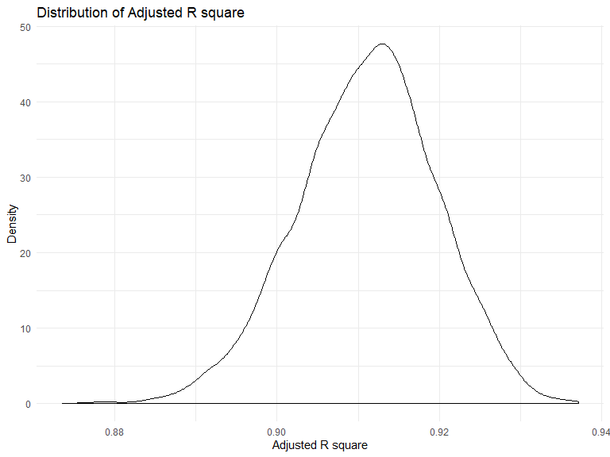
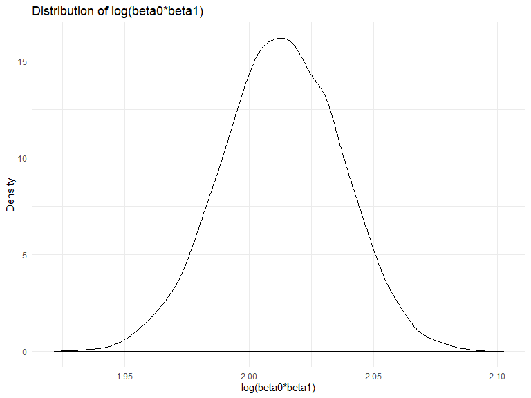

homework6
================
Guangling Xu
2019/11/24

-----

``` r
library(tidyverse)
```

    ## -- Attaching packages ------- tidyverse 1.2.1 --

    ## √ ggplot2 3.2.1     √ purrr   0.3.2
    ## √ tibble  2.1.3     √ dplyr   0.8.3
    ## √ tidyr   1.0.0     √ stringr 1.4.0
    ## √ readr   1.3.1     √ forcats 0.4.0

    ## -- Conflicts ---------- tidyverse_conflicts() --
    ## x dplyr::filter() masks stats::filter()
    ## x dplyr::lag()    masks stats::lag()

``` r
knitr::opts_chunk$set(
    echo = TRUE,
    warning = FALSE,
    fig.width = 8, 
  fig.height = 6,
  out.width = "90%"
)
options(
  ggplot2.continuous.colour = "viridis",
  ggplot2.continuous.fill = "viridis"
)
scale_colour_discrete = scale_colour_viridis_d
scale_fill_discrete = scale_fill_viridis_d
theme_set(theme_minimal() + theme(legend.position = "bottom"))
```

### Data Cleaning

``` r
birthweight =
  read_csv("./data/birthweight.csv") %>% 
  janitor::clean_names() %>% 
  mutate(
    babysex = factor(babysex, labels = c("male", "female")),
    frace  = factor(frace, labels = c("White","Black","Asian","Puerto Rican","Other")),
    malform = factor(malform, labels = c("absent","present")),
    mrace = factor(mrace, labels = c("White","Black","Asian","Puerto Rican")),
    babysex = fct_infreq(babysex),
    frace = fct_infreq(frace),
    malform=  fct_infreq(malform),
    mrace = fct_infreq(mrace)
     )
```

    ## Parsed with column specification:
    ## cols(
    ##   .default = col_double()
    ## )

    ## See spec(...) for full column specifications.

### Model Building

First we hypothesize that birthweight was affected by all the predcitors
given by the dataset.

``` r
reg_lbt_m = lm(bwt ~ babysex + bhead + blength + delwt + fincome + frace + gaweeks + menarche + momage + mheight + mrace + parity + pnumlbw + pnumsga + ppbmi + ppwt + smoken + wtgain, data = birthweight)  

summary(reg_lbt_m)
```

    ## 
    ## Call:
    ## lm(formula = bwt ~ babysex + bhead + blength + delwt + fincome + 
    ##     frace + gaweeks + menarche + momage + mheight + mrace + parity + 
    ##     pnumlbw + pnumsga + ppbmi + ppwt + smoken + wtgain, data = birthweight)
    ## 
    ## Residuals:
    ##      Min       1Q   Median       3Q      Max 
    ## -1097.66  -184.94    -3.24   173.08  2343.95 
    ## 
    ## Coefficients: (3 not defined because of singularities)
    ##                     Estimate Std. Error t value Pr(>|t|)    
    ## (Intercept)       -6264.3404   660.2824  -9.487  < 2e-16 ***
    ## babysexfemale        28.6899     8.4633   3.390 0.000705 ***
    ## bhead               130.7818     3.4518  37.888  < 2e-16 ***
    ## blength              74.9491     2.0212  37.082  < 2e-16 ***
    ## delwt                 4.1026     0.3946  10.398  < 2e-16 ***
    ## fincome               0.2893     0.1795   1.612 0.107079    
    ## fraceBlack           14.3004    46.1444   0.310 0.756647    
    ## fracePuerto Rican   -47.0259    44.6726  -1.053 0.292548    
    ## fraceAsian           21.1932    69.2874   0.306 0.759716    
    ## fraceOther            4.2345    74.0643   0.057 0.954410    
    ## gaweeks              11.5473     1.4651   7.881 4.07e-15 ***
    ## menarche             -3.5553     2.8946  -1.228 0.219407    
    ## momage                0.7629     1.2217   0.624 0.532390    
    ## mheight               9.7740    10.3099   0.948 0.343172    
    ## mraceBlack         -151.4348    46.0401  -3.289 0.001013 ** 
    ## mracePuerto Rican   -56.5081    45.1313  -1.252 0.210607    
    ## mraceAsian          -91.4092    71.9106  -1.271 0.203744    
    ## parity               95.5166    40.4743   2.360 0.018322 *  
    ## pnumlbw                   NA         NA      NA       NA    
    ## pnumsga                   NA         NA      NA       NA    
    ## ppbmi                 4.3385    14.8892   0.291 0.770769    
    ## ppwt                 -3.4707     2.6118  -1.329 0.183972    
    ## smoken               -4.8524     0.5868  -8.269  < 2e-16 ***
    ## wtgain                    NA         NA      NA       NA    
    ## ---
    ## Signif. codes:  0 '***' 0.001 '**' 0.01 '*' 0.05 '.' 0.1 ' ' 1
    ## 
    ## Residual standard error: 272.4 on 4321 degrees of freedom
    ## Multiple R-squared:  0.7183, Adjusted R-squared:  0.717 
    ## F-statistic:   551 on 20 and 4321 DF,  p-value: < 2.2e-16

Then we drop out those whose `p.value` is larger than 0.05 and refit the
model.

``` r
reg_lbt_m_sex = lm(bwt~ babysex + bhead + blength + delwt + gaweeks + parity + smoken, data = birthweight)
broom::tidy(reg_lbt_m_sex) %>% 
  select(term, estimate, p.value) %>% 
  knitr::kable()
```

| term          |      estimate |   p.value |
| :------------ | ------------: | --------: |
| (Intercept)   | \-6294.042648 | 0.0000000 |
| babysexfemale |     29.759772 | 0.0006604 |
| bhead         |    137.023526 | 0.0000000 |
| blength       |     78.868332 | 0.0000000 |
| delwt         |      2.074414 | 0.0000000 |
| gaweeks       |     14.357065 | 0.0000000 |
| parity        |    102.302116 | 0.0142252 |
| smoken        |    \-2.168761 | 0.0001965 |

The table shows that all the predictors now cnotribute to the fitted
model due to small `p.value`.

There for the model we set on the factors underying birthweight is
`birthweight ~ babysex + bhead + blength + delwt + gaweeks + parity +
smoken`.

### Diagnositic

Then we diagonise whether the linear model fit.

``` r
resplot_mrace= birthweight %>% 
  modelr::add_residuals(reg_lbt_m_sex) %>% 
  modelr::add_predictions(reg_lbt_m_sex) %>%
  ggplot(aes(x = pred, y = resid)) + geom_point()+
  geom_line( y = 0, color = "red")+
  labs(
    title = "Model Residuals against Fitted Values",
    x = "Fitted values",
    y = "Residuals"
  )
resplot_mrace
```



From the plot above,we can see that most of the fitted values lie
between 2000-4000 and most of the residuals are randomly lie around
zero, indicating linearity .

### Comparing models

``` r
reg_model1 = lm(bwt~ babysex + bhead + blength + delwt + gaweeks + parity + smoken, data = birthweight)
reg_model2 = lm(bwt ~ blength + gaweeks, data = birthweight)
reg_model3 = lm(bwt~ bhead*blength + bhead *babysex + blength*babysex + bhead*babysex*blength,  data = birthweight)
```

``` r
reg_model2 %>%  
  broom::tidy() %>%  
  select(term, estimate, p.value)%>% 
  knitr::kable()
```

| term        |     estimate | p.value |
| :---------- | -----------: | ------: |
| (Intercept) | \-4347.66707 |       0 |
| blength     |    128.55569 |       0 |
| gaweeks     |     27.04673 |       0 |

This table shows that blength and gaweeks all have extremly small
`p.value`, indicating the conefficient of these two are both away from
zero.

``` r
reg_model3 %>%
  broom::tidy() %>%
  select(term, estimate, p.value)%>%  
  knitr::kable()
```

| term                        |       estimate |   p.value |
| :-------------------------- | -------------: | --------: |
| (Intercept)                 | \-7176.8170221 | 0.0000000 |
| bhead                       |    181.7956350 | 0.0000018 |
| blength                     |    102.1269235 | 0.0000992 |
| babysexfemale               |   6374.8683508 | 0.0001469 |
| bhead:blength               |    \-0.5536096 | 0.4780117 |
| bhead:babysexfemale         |  \-198.3931810 | 0.0001047 |
| blength:babysexfemale       |  \-123.7728875 | 0.0004288 |
| bhead:blength:babysexfemale |      3.8780531 | 0.0002453 |

This table shows that except for the interaction between `bhead` and
`blength`, all other covariates have coefficients far away from zero.

``` r
cv_df =
  modelr::crossv_mc(birthweight, 100) %>% 
  mutate(
    train = map(train, as_tibble),
    test = map(test, as_tibble))

cv_df = 
  cv_df %>% 
  mutate(reg_model1  = map(train, ~lm(bwt~ mrace + babysex, data = .x)),
         reg_model2   = map(train, ~lm(bwt ~ blength + gaweeks, data = .x)),
         reg_model3  = map(train, ~lm(bwt~ bhead+ blength + babysex + bhead*blength + bhead *babysex + blength*babysex + bhead*babysex*blength, data = as_tibble(.x)))) %>% 
  mutate(rmse_model1 = map2_dbl(reg_model1 , test, ~modelr::rmse(model = .x, data = .y)),
         rmse_model2  = map2_dbl(reg_model2, test, ~modelr::rmse(model = .x, data = .y)),
         rmse_model3 = map2_dbl(reg_model3, test, ~modelr::rmse(model = .x, data = .y)))
```

``` r
cv_df %>% 
  select(starts_with("rmse")) %>% 
pivot_longer(
    everything(),
    names_to = "model", 
    values_to = "rmse",
    names_prefix = "rmse_") %>% 
  mutate(model = fct_inorder(model)) %>% 
  ggplot(aes(x = model, y = rmse)) + geom_violin(aes(fill = model))+
  labs(
    title = "Root Mean Square Error Comparison",
    x = "Models",
    y = "Root Mean Square Error"
  )
```


Based on the plot above, it is clear that the third model with the
lowest RMSE ,which is the one using head circumference, length, sex, and
all interactions (including the three-way interaction) between these
fits the best.

## Problem 2

``` r
weather_df = 
  rnoaa::meteo_pull_monitors(
    c("USW00094728"),
    var = c("PRCP", "TMIN", "TMAX"), 
    date_min = "2017-01-01",
    date_max = "2017-12-31") %>%
  mutate(
    name = recode(id, USW00094728 = "CentralPark_NY"),
    tmin = tmin / 10,
    tmax = tmax / 10) %>%
  select(name, id, everything())

set.seed(1)
```

### Drawing many bootstrap samples

``` r
reg_weather = lm(tmax ~ tmin,data = weather_df)
```

``` r
boot_sample = function(df) {
  sample_frac(df, replace = TRUE)
}

boot_straps = 
  data_frame(
    strap_number = 1:5000,
    strap_sample = rerun(5000, boot_sample(weather_df ))
  )
```

### Distribution of estimate quantities

``` r
bootstrap_results = 
  boot_straps %>% 
  mutate(
    models = map(strap_sample, ~lm(tmax ~ tmin, data = .x) ),
    results = map(models, broom::glance)) %>% 
  select(-strap_sample, -models) %>% 
  unnest() 


bootstrap_results_log = 
  boot_straps %>% 
  mutate(
    models = map(strap_sample, ~lm(tmax ~ tmin, data = .x) ),
    results = map(models, broom::tidy)) %>%
  select(-strap_sample, -models) %>% 
  unnest() %>% 
  select(strap_number,term, estimate)

bootstrap_results_log = bootstrap_results_log %>% 
  mutate(
    term = factor(term,labels = c("beta0","beta1"))
  ) %>% 
  pivot_wider(
    names_from = "term",
    values_from = "estimate"
  ) %>% 
  mutate(
    log_beta0_beta1 = log(beta0*beta1)
  )


estimate_r = data.frame(
  quantity = "adj_r_squared",
  estimate_mean = mean(pull(bootstrap_results, adj.r.squared)), 
  estimate_sd = sd(pull(bootstrap_results, adj.r.squared))
)


estimate_log = data.frame(
  quantity = "log_beta0_1",
  estimate_mean = mean(pull(bootstrap_results_log, log_beta0_beta1)), 
  estimate_sd = sd(pull(bootstrap_results_log,log_beta0_beta1))
)


bind_rows(estimate_r, estimate_log) %>% 
  knitr::kable()
```

| quantity        | estimate\_mean | estimate\_sd |
| :-------------- | -------------: | -----------: |
| adj\_r\_squared |      0.9110864 |    0.0085989 |
| log\_beta0\_1   |      2.0131027 |    0.0239315 |

### Plot the distribution of Adjusted R Squared

``` r
bootstrap_results%>% 
  ggplot(aes(x = adj.r.squared))+
  geom_density() +
  labs(
    title = "Distribution of Adjusted R square",
    x = "Adjusted R square",
    y = "Density"
  )
```



  - Description: The distribution of Adjusted R square shows that this
    distribution has a heavy tail extending to low values and a bit of a
    “shoulder”, features that may be related to the frequency with which
    large outliers are included in the bootstrap sample.

### Plot the distribution of log(beta0 \* beta1)

``` r
 bootstrap_results_log %>% 
   ggplot(aes(x = log_beta0_beta1))+
   geom_density() +
   labs(
    title = "Distribution of log(beta0*beta1)",
    x = "log(beta0*beta1)",
    y = "Density"
  )
```



  - Description: The distribution of log(β0 ∗ β1) shows that this
    distribution seems normal, features that may be related to the few
    outliers are included in the bootstrap sample. This indicates and
    transformation of certain estimates could solve the non-normality
    problem caused by outliers.

### Quantile for Adjusted R squared and log(beta0, beta1)

``` r
CI_result = 
  tibble(
    Conf_int = c("lwr","upr"),
    CI_R_squared = quantile(pull(bootstrap_results,adj.r.squared), probs = c(0.025, 0.975),na.rm = TRUE),
    CI_logbeta0_1 =  quantile(pull(bootstrap_results_log,log_beta0_beta1), probs = c(0.025, 0.975), na.rm = TRUE)
  )
  
CI_result %>% 
   knitr::kable(digits = 3)
```

| Conf\_int | CI\_R\_squared | CI\_logbeta0\_1 |
| :-------- | -------------: | --------------: |
| lwr       |          0.893 |           1.965 |
| upr       |          0.927 |           2.059 |

  - Description:From the table above, we can see that the 95% confidence
    interval for adjusted R squared is \[0.893, 0.927\]. The 95%
    confidence interval for log(β0 ∗ β1) is \[1.967, 2.059\].
